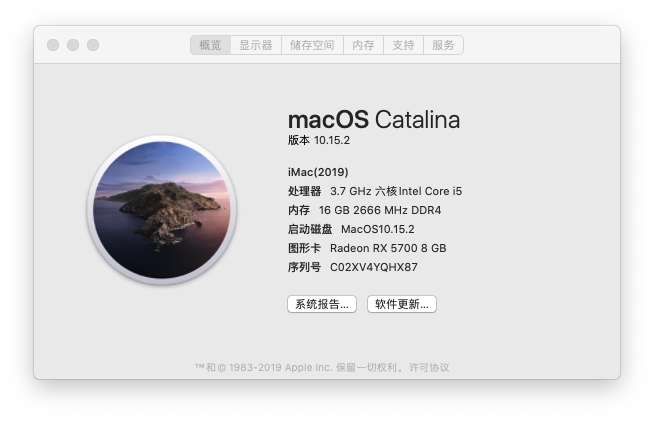
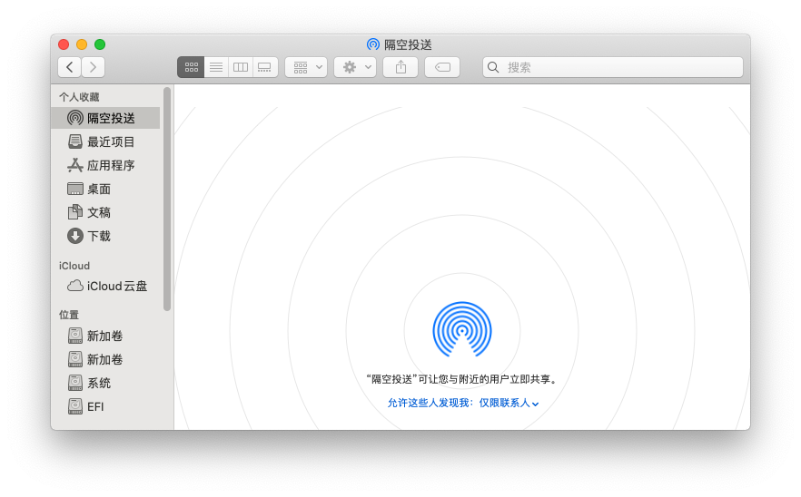
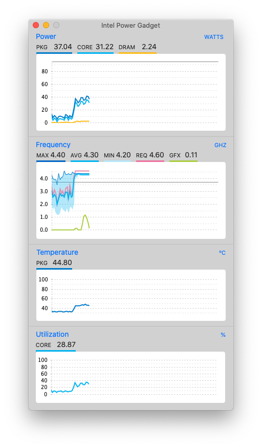

# Hackintosh EFI
我的黑苹果 Clover EFI配置

# 我为什么要弄一台黑苹果


# 主板设置
更新了最新bios(version:2012)的主板需要前往bios中更改
```
Advanced —> Onboard Devices Configuration-Serial Port Configuration Serial Port —> Off
Advanced —> USB Configuration-XHCI Hand-off —> Enabled
Secure Boot -> OS Type -> Other OS
Advanced —> PCH configuration-IOAPIC 24-119 Entries —> disabled
CFG-LOCK -> disabled
Advanced -> Advanced PCH Configuration -> system time and alarm source -> Legacy RTC
```

# 配置如下

| 项目        | 配置   |
| --------   | :-----  |
| CPU        | 英特尔（Intel）i5-9600K | 
| 内存        |   [芝奇（G.SKILL）8GB DDR4 2666](https://item.jd.com/7063936.html)                           |
| 主板        |   [华硕（ASUS）TUF B360M-PLUS GAMING S](https://item.jd.com/8074512.html)                    | 
| 显卡        |   [华硕（ASUS）Radeon RX 5700](https://item.jd.com/100003842991.html)                        | 
| 硬盘        |   [紫光存储（UNIC MEMORY） 512GB SSD固态硬盘 P100系列](https://item.jd.com/100003031751.html)   | 
|无线网卡      |   [BCM94360CS2 (免驱WIFI和蓝牙)](https://item.taobao.com/item.htm?spm=a1z09.2.0.0.16d52e8dhvtHEC&id=611287782442&_u=c1k395q4d696)|

# 问题解决

- [x] 显卡免驱完美
- [x] 有线以太网卡完美
- [x] 声卡（有声音，可使用siri）
- [x] USB3.1完美
- [x] 完美睡眠唤醒
- [x] 可登陆icloud，app store正常(若提示设备账户数量达到限制使用 Clover Configurator 生成新的序列号看看)
- [x] 同时驱动核显和独显
- [x] 快速预览正常

# 截图展示






